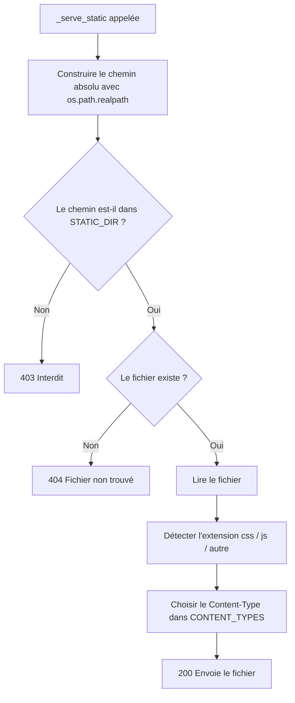

```mermaid
flowchart TD
    A[_serve_static appelée] --> B[Construire le chemin absolu avec os.path.realpath]
    B --> C{Le chemin est-il dans STATIC_DIR ?}
    C -->|Non| D[403 Interdit]
    C -->|Oui| E{Le fichier existe ?}
    E -->|Non| F[404 Fichier non trouvé]
    E -->|Oui| G[Lire le fichier]
    G --> H[Détecter l'extension css / js / autre]
    H --> I[Choisir le Content-Type dans CONTENT_TYPES]
    I --> J[200 Envoie le fichier]
```