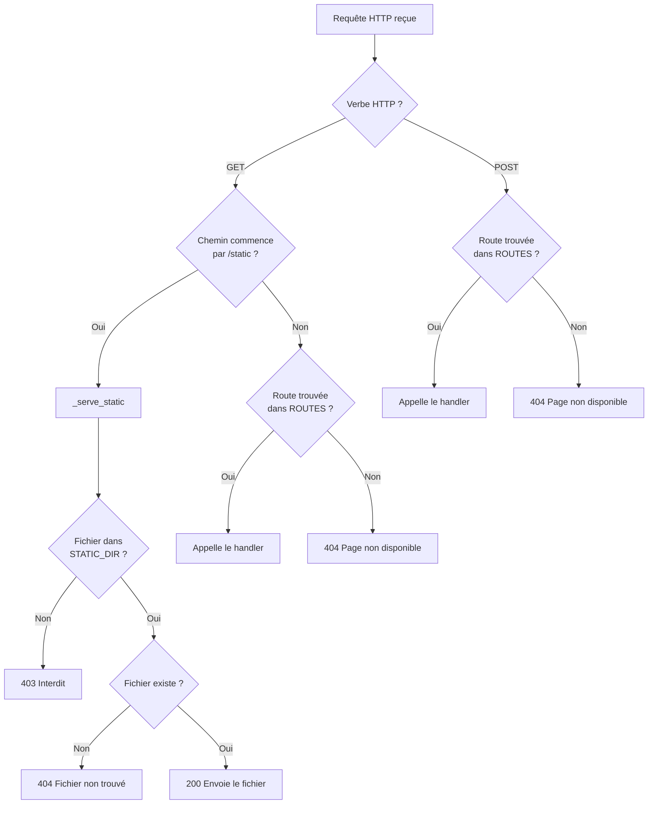

```mermaid
flowchart TD
    A[Requête HTTP reçue] --> B{Verbe HTTP ?}

    B -->|GET| C{Chemin commence\npar /static ?}
    C -->|Oui| D[_serve_static]
    D --> E{Fichier dans\nSTATIC_DIR ?}
    E -->|Non| F[403 Interdit]
    E -->|Oui| G{Fichier existe ?}
    G -->|Non| H[404 Fichier non trouvé]
    G -->|Oui| I[200 Envoie le fichier]

    C -->|Non| J{Route trouvée\ndans ROUTES ?}
    J -->|Oui| K[Appelle le handler]
    J -->|Non| L[404 Page non disponible]

    B -->|POST| M{Route trouvée\ndans ROUTES ?}
    M -->|Oui| N[Appelle le handler]
    M -->|Non| O[404 Page non disponible]
```