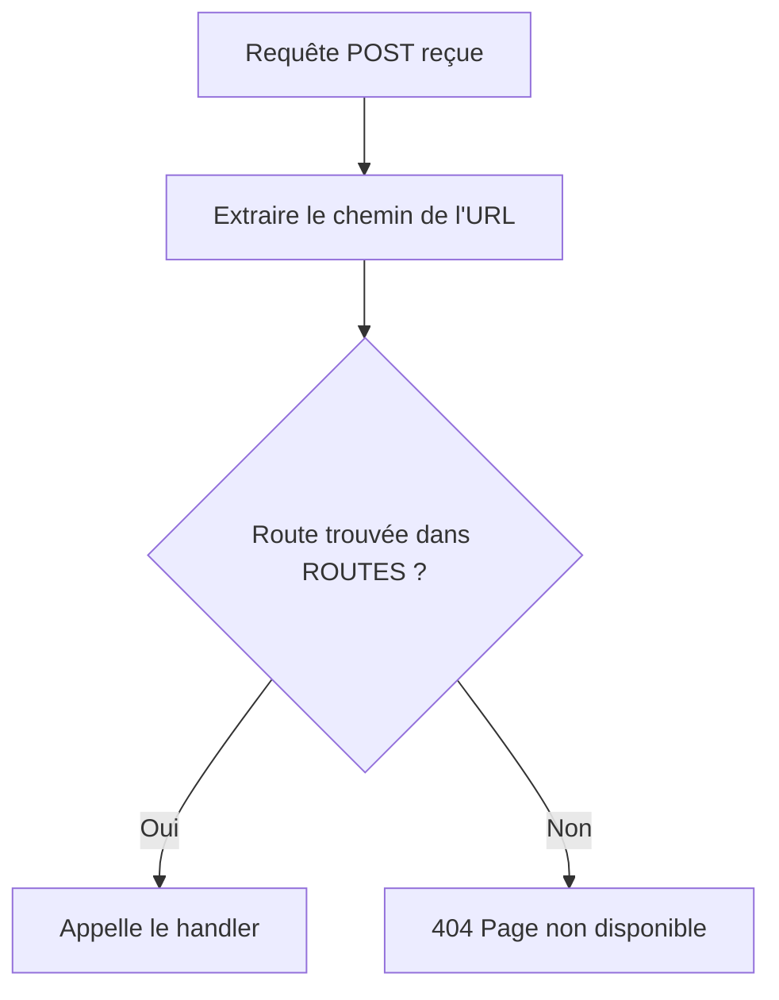

```mermaid
flowchart TD
    A[Requête POST reçue] --> B[Extraire le chemin de l'URL]
    B --> C{Route trouvée dans ROUTES ?}
    C -->|Oui| D[Appelle le handler]
    C -->|Non| E[404 Page non disponible]
```
