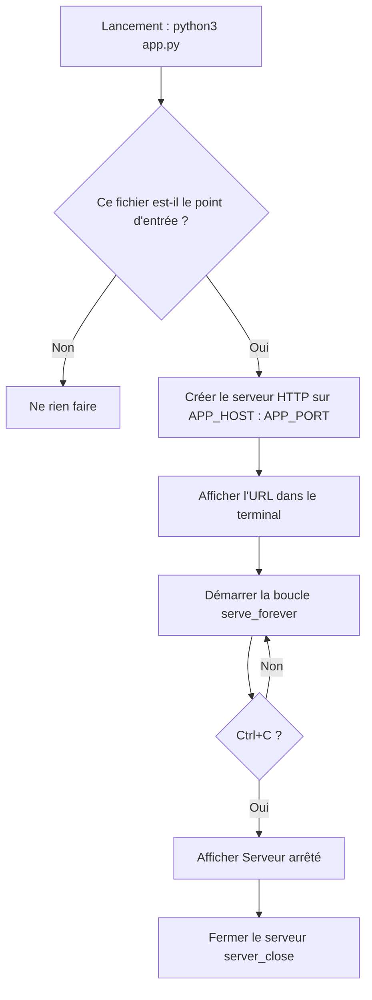

```mermaid
flowchart TD
    A[Lancement : python3 app.py] --> B{Ce fichier est-il le point d'entrée ?}
    B -->|Non| C[Ne rien faire]
    B -->|Oui| D[Créer le serveur HTTP sur APP_HOST : APP_PORT]
    D --> E[Afficher l'URL dans le terminal]
    E --> F[Démarrer la boucle serve_forever]
    F --> G{Ctrl+C ?}
    G -->|Non| F
    G -->|Oui| H[Afficher Serveur arrêté]
    H --> I[Fermer le serveur server_close]
```

